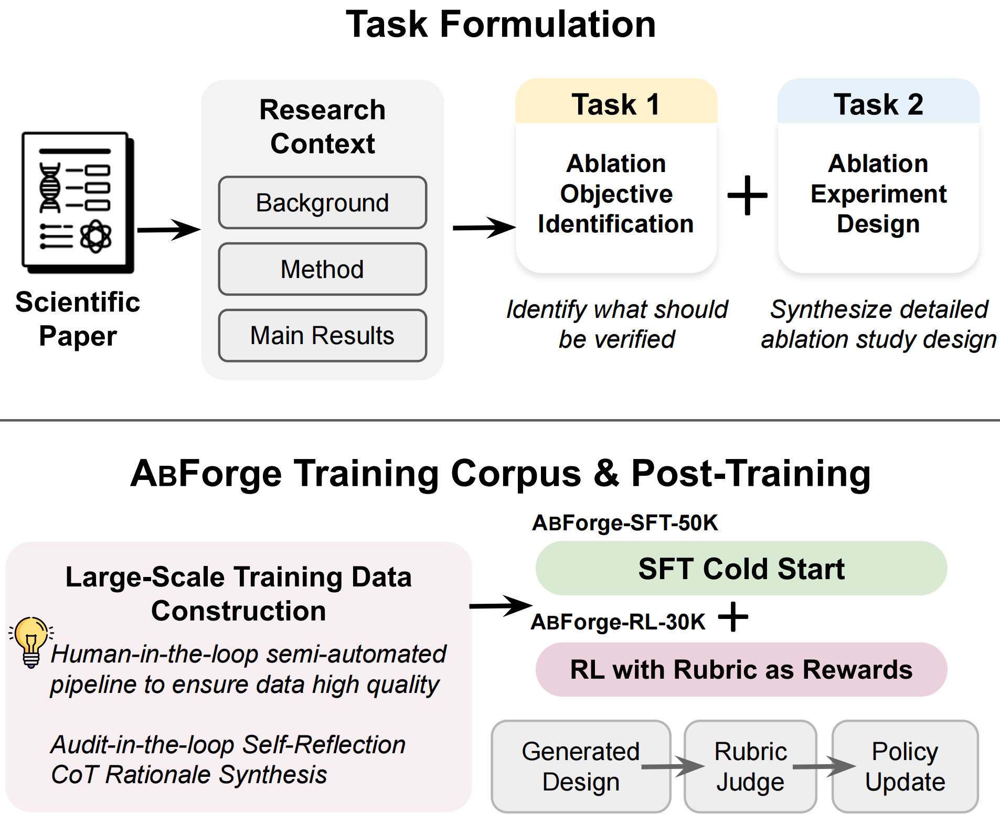

# ABForge: Post-Training for Paper-Grounded Ablation Design

<p align="center">
    🤗 <a href="https://huggingface.co/SlowGuess">Hugging Face</a>&nbsp&nbsp | &nbsp&nbsp📄 <a href="https://arxiv.org/abs/XXXX.XXXXX">arXiv</a>
</p>

<!-- TODO: replace the 🤗 Hugging Face and 📄 arXiv links above with the paper / HF collection URLs once public. The dataset link is in the Resources section below. -->

## 📖 Abstract

Ablation studies are central to testing scien-
tific claims, yet designing a rigorous paper-
grounded ablation remains difficult. We for-
mulate this problem as two tasks, Ablation
Objective Identification and Ablation Exper-
iment Synthesis, and introduce AblationBench,
an expert-annotated benchmark for evaluating
both. To support post-training, we construct
the ABForge post-training corpus through a
semi-automated audit-in-the-loop pipeline that
extracts ablation objectives, performs abla-
tion specification completion, synthesizes self-
reflection CoT rationales, and derives target-
specific evaluation rubrics. We then post-train
Qwen-3-8B with supervised fine-tuning fol-
lowed by rubric-based reinforcement learning.
The resulting model improves the base model
from 44.4 to 55.9 on objective identification
and from 43.4 to 62.4 on experiment synthesis
in automated evaluation, and is the strongest
open-source model in human evaluation.

<div align="center">

<p><em>Overview of ABForge.</em></p>
</div>


## 🔗 Resources

- Training & evaluation data: [`SlowGuess/abforge-data`](https://huggingface.co/datasets/SlowGuess/abforge-data)

ABForge covers two tasks:

- **Task 1 — Ablation objective identification:** identify the key ablation
  objectives / research questions a paper should investigate.
- **Task 2 — Ablation plan synthesis:** produce a rigorous ablation experiment
  plan (objective, baseline setup, variants, fixed protocols & metrics).

ABForge trains a **single unified model** that handles both tasks: Task 1 and
Task 2 examples are mixed at a 1:1 ratio in both the SFT and RL stages, and
during RL each rollout is routed to its task-specific reward by the sample's
`data_source` field.

## 🚀 Quick Start

### Installation

```bash
git clone https://github.com/SlowGuess/Abforge_1.git
cd Abforge_1

conda create -n abforge python=3.11 -y
conda activate abforge

# Install the customized verl training stack, then ABForge dependencies.
pip install -e verl_proj
pip install -r requirements.txt
```

The repository keeps ABForge-specific code **outside** `verl_proj/` where
possible, so the framework and the project code stay decoupled.

### Configuration

ABForge is driven by a few environment variables; set them in your shell or job
launcher before running the scripts below:

```bash
export ABFORGE_ROOT=/path/to/Abforge_1     # repo root
export MODEL_PATH=Qwen/Qwen3-8B            # base model to train

# OpenAI-compatible judge endpoint (hosted API or local vLLM)
export JUDGE_API_BASE=http://127.0.0.1:8000/v1
export JUDGE_API_KEY=dummy
export JUDGE_MODEL=<your-judge-model>

# unified reward server port
export COMBINED_REWARD_PORT=6010
```

### Data

Full training and evaluation data is available at
[`SlowGuess/abforge-data`](https://huggingface.co/datasets/SlowGuess/abforge-data).

Download the JSONL files:

```bash
huggingface-cli download SlowGuess/abforge-data \
  --repo-type dataset \
  --local-dir data
```

Convert each task's training files to parquet:

```bash
# SFT
python dataprocess/prepare_sft.py \
  --task 1 \
  --sft_data_path data/train/sft_task1_45961.jsonl \
  --sft_remain_path data/train/SFT_50K.jsonl \
  --local_dir data/abforge_task1_sft

python dataprocess/prepare_sft.py \
  --task 2 \
  --sft_data_path data/train/sft_task2_37019.jsonl \
  --sft_remain_path data/train/SFT_50K.jsonl \
  --local_dir data/abforge_task2_sft

# RL
python dataprocess/prepare_task1_rl.py \
  --input data/train/RL_task1_30K.jsonl \
  --local_dir data/abforge_task1_rl

python dataprocess/prepare_task2_rl.py \
  --input data/train/RL_task2_30K.jsonl \
  --local_dir data/abforge_task2_rl
```

Then merge them into the unified (mixed 1:1) training sets consumed by the
training scripts:

```bash
python dataprocess/prepare_combined.py --mode sft \
  --task1_dir data/abforge_task1_sft --task2_dir data/abforge_task2_sft \
  --out_dir data/abforge_combined_sft

python dataprocess/prepare_combined.py --mode rl \
  --task1_dir data/abforge_task1_rl --task2_dir data/abforge_task2_rl \
  --out_dir data/abforge_combined_rl
```

The held-out evaluation files are under `data/eval/`. Use
`ablationbench_1000.jsonl` for the full benchmark and
`ablationbench_200.jsonl` for the clean 200-instance human-evaluation subset.

> **Task defaults.** Task 1 SFT/RL preprocessing keeps papers with 2–6
> ground-truth focuses by default. See
> [`dataprocess/task1.md`](dataprocess/task1.md) and [`dataprocess/task2.md`](dataprocess/task2.md)
> for the configurable defaults.

## 🛠️ Training

### SFT

Fine-tune the base model on the mixed Task 1 + Task 2 SFT data:

```bash
MODEL_PATH=Qwen/Qwen3-8B scripts/train_sft.sh
```

The SFT launcher uses the external dataset class at
`dataprocess/abforge_sft_dataset.py` and passes it to `verl` via
`data.custom_cls.path`.

### Reward Server

RL uses a single unified reward server (`reward/combined_reward.py`). It
exposes `POST /get_reward` and routes each request to the Task 1 judge
(specificity-weighted objective matching + structural penalties) or the Task 2
judge (weighted rubric score + format/length penalties) based on the sample's
`data_source`. The underlying judge is an OpenAI-compatible chat-completions
endpoint — a hosted API or a local vLLM server.

Hosted or existing endpoint:

```bash
export JUDGE_API_BASE=https://api.openai.com/v1
export JUDGE_API_KEY=...
export JUDGE_MODEL=...

scripts/serve_reward_api.sh
```

Local vLLM judge (serve any OpenAI-compatible model locally):

```bash
JUDGE_MODEL=<your-judge-model> TP_SIZE=2 PORT=8000 scripts/serve_local_judge_vllm.sh

export JUDGE_API_BASE=http://127.0.0.1:8000/v1
export JUDGE_API_KEY=dummy
export JUDGE_MODEL=<your-judge-model>
scripts/serve_reward_api.sh
```

### RL (GRPO)

Start the services in this order:

1. Start a judge endpoint, or point `JUDGE_API_BASE` to an existing
   OpenAI-compatible API.
2. Start the unified ABForge reward server.
3. Run the RL launcher with `REWARD_URL` pointing to that reward server.

```bash
# 1 + 2: judge + reward server
JUDGE_MODEL=<your-judge-model> TP_SIZE=2 PORT=8000 scripts/serve_local_judge_vllm.sh

export JUDGE_API_BASE=http://127.0.0.1:8000/v1
export JUDGE_API_KEY=dummy
export JUDGE_MODEL=<your-judge-model>
scripts/serve_reward_api.sh
```

Then, in another shell:

```bash
# 3: RL launcher (point MODEL_PATH at your SFT checkpoint)
MODEL_PATH=outputs/checkpoints/sft scripts/train_rl.sh
```

The RL launcher runs 200 GRPO steps by default (twice a single-task schedule,
since each task is ~50% of the mixed batch) and validates/saves every 20
steps. Validation score typically peaks well before the schedule ends; select
the best-validation checkpoint rather than the last one.

## 📈 Evaluation

Evaluation is per-task. The evaluation scripts use the same OpenAI-compatible
judge configuration as the reward server:

```bash
export JUDGE_API_BASE=https://api.openai.com/v1
export JUDGE_API_KEY=...
export JUDGE_MODEL=...

scripts/evaluate_task1.sh outputs/task1_infer.jsonl
scripts/evaluate_task2.sh outputs/task2_infer.jsonl
```

## 🗂️ Repository Layout

- `verl_proj/` — the (lightly customized) `verl` training framework.
- `dataprocess/` — all data handling: per-task JSONL→parquet conversion
  (`prepare_*.py`), the unified-mixture merge (`prepare_combined.py`), the
  external SFT dataset class (`abforge_sft_dataset.py`), task defaults
  (`task1.md` / `task2.md`), and `examples/` schema samples (full data on Hugging Face).
- `reward/` — the unified reward server for RL (`combined_reward.py`), which
  routes to the Task 1 / Task 2 rubric judges by `data_source`.
- `scripts/` — launchers for SFT, RL, the reward server, local judges, and eval.
- `eval/` — evaluation scripts.

## 🙏 Acknowledgements

This repository builds on the excellent [verl](https://github.com/volcengine/verl)
project. ABForge code is released under the Apache-2.0 License (see
[`LICENSE`](LICENSE)).

## 📝 Citation

<!-- TODO: replace with the final paper citation once available. -->

If you find ABForge useful in your research, please cite our paper:

```bibtex
@misc{abforge2026,
      title={ABForge: Post-Training for Paper-Grounded Ablation Design},
      author={TODO},
      year={2026},
      eprint={XXXX.XXXXX},
      archivePrefix={arXiv},
      primaryClass={cs.CL},
      url={https://arxiv.org/abs/XXXX.XXXXX},
}
```
